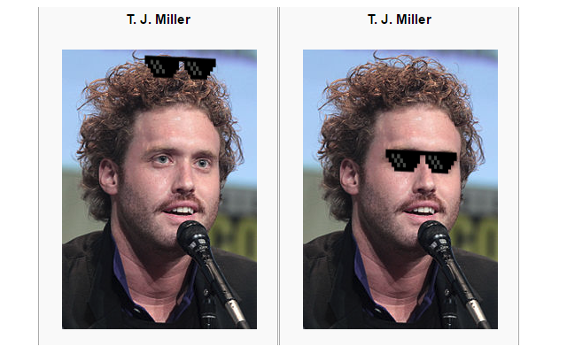

# Shades
## automatically ruin Wikipedia biography portraits, clientside
### Revan Sopher 2016

## What?
A chrome extension to slide in "deal with it" sunglasses onto Wikipedia portraits.
Install link at the top of the page.

## Why?
TODO

## Where do I configure this?

You don't. Sit back and accept your new reality.

## Why do only some people get shades?

Unfortunately some people are just irredeemably uncool. It's not even worth trying.

## You're saying John Cena isn't cool enough?

Okay fine, the tracking library is pretty finicky and often can't find the eyes.

It _is_ super cool that it's all done in browser, though. [Check them out!](https://github.com/eduardolundgren/tracking.js)
